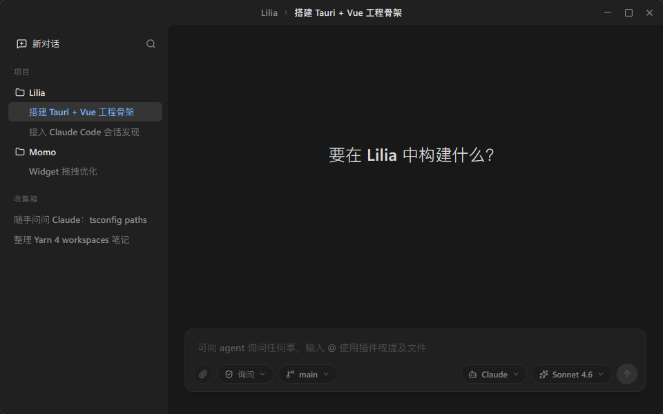

<!-- To replace the main window screenshot, keep the file name .github/assets/main-window.png to avoid README changes. -->

> English | [简体中文](README.zh-CN.md) | [Documentation](https://sena-nana.github.io/Lilia/)

> **Development Status**
>
> LiliaCode is still changing quickly. Core features are not fully complete, and the local database schema may change as new features land. Data may be cleared or migrated at any time, so do not rely on it as the only copy of important production work.

<p align="center">
  
</p>

<h1 align="center">LiliaCode</h1>

<p align="center">
  <a href="https://qm.qq.com/q/WViyGEq8oA">
    
  </a>
</p>

<p align="center"><strong>A desktop client for agent-assisted software engineering.</strong></p>

<p align="center">LiliaCode organizes Claude Code and Codex workflows into recoverable, traceable, and schedulable local task state, helping developers manage project sessions, context, todos, and execution history.</p>

<p align="center">
  
</p>

---

## Product Positioning

LiliaCode is the software engineering workbench in the Lilia family. It does not simply wrap Claude Code or Codex in a chat window; instead, it adds a desktop-level organization layer for projects, tasks, sessions, permissions, and process state outside the agent execution layer.

It is built for developers who move engineering projects forward over time. Each conversation can be treated as a manageable task, while agent execution details and pending interactions are saved as local state. This provides the foundation for future task trees, automatic orchestration, and multi-agent collaboration.

## The Lilia Family

Lilia is a family of toolchain applications for high-collaboration agent workflows. Its goal is to connect different agents, execution environments, and engineering workflows into one observable, schedulable, and recoverable local workbench.

LiliaCode focuses on software engineering. Other applications in the same family may expand into additional agent collaboration workflows while sharing the same ideas around project state, task-based sessions, plugin capabilities, and human-agent collaboration boundaries.

## What Makes It Different

- Task-based sessions: manage conversations as tasks instead of only saving chat history.
- Local engineering state: record projects, sessions, todos, process details, and key interactions for easier recovery and continuation.
- Observable process: use a timeline to show agent reasoning, tool calls, command execution, file changes, and final responses.
- Non-interruptive interaction: move permission requests, plan confirmations, and agent questions into a pending area so they do not take over the input flow.
- Collaboration-ready structure: provide a shared shape for task trees, dependencies, orchestration, and helper agents.

Because LiliaCode uses its own session storage model instead of upstream CLI or SDK history formats, compatibility with raw original conversation history is not a goal. It prioritizes its own recoverable task structure.

## Feature Status

The list below describes the intended product capabilities. Checked items are currently usable as user-facing features; unchecked items are planned but not fully complete.

### Shared Agent Capabilities

- [x] Permission modes: choose execution scope by risk level, including full access, ask-first, and read-only modes.
- [x] Todo display: show the agent's current task list and progress.
- [x] Process timeline: distinguish and display agent reasoning, commands, tool calls, file changes, and replies.
- [x] Key node navigation: highlight important timeline nodes in the scrollbar and support quick jumps.
- [x] Non-interruptive interaction mode: move permission requests, agent questions, and plan confirmations into a pending area instead of taking over the input box.
- [x] Guidance queue: provide a priority action queue so user messages and plugin behavior enter a unified guidance flow.
- [x] Basic MCP integration: discover and connect MCP servers from agent configuration.
- [ ] Unified interaction protocol: unify plan confirmations, tool confirmations, and agent questions across backends.
- [ ] Intelligent model selection: automatically choose model level and reasoning intensity based on request type.
- [x] File context: mention files, directories, images, and other context with `@`.
- [ ] Slash commands: support backend-native commands and project-defined commands.

### Claude Code Integration

- [x] Claude conversations: start new conversations and continue history sessions in LiliaCode.
- [x] Claude Skills: manage user-level and project-level Claude Skills.
- [x] Claude MCP management: add, edit, and remove external Claude MCP servers in the UI.
- [ ] Claude Plugins: fully manage Claude Plugin installation, enablement, updates, and scope.
- [ ] Claude Hooks: manage Claude Code Hooks and show execution results.
- [ ] Claude Subagents: display and schedule Claude Code Subagents and custom agents.

### Codex Integration

- [x] Codex conversations: start new conversations and continue history sessions in LiliaCode.
- [x] Codex process display: show Codex reasoning, commands, file changes, searches, and final replies.
- [x] Codex environment checks: show whether the Codex CLI, API, and connection state are available.
- [x] Codex MCP discovery: reuse Codex configuration to connect MCP servers.
- [ ] Codex MCP management: add, edit, and remove Codex MCP servers inside LiliaCode.
- [ ] Codex profiles: support profiles, sandbox and approval presets, and project-level configuration.
- [ ] Codex workflows: support common flows such as code review, fix suggestions, and batch changes.
- [ ] Built-in browser interaction: interact with users or debug code through IAB.

### LiliaCode-Specific Features

- [ ] Project management: manage local projects and GitHub-cloned projects, and view project-level progress, data, and cost.
- [ ] Task-based conversations: manage conversations as tasks for project-level scheduling.
- [ ] Task tree: manage parent-child tasks, dependencies, and blockers.
- [ ] Automatic orchestration: schedule multiple agents based on task state, dependencies, and user strategy.
- [ ] Plugin system: expose capabilities that change agent behavior as selectable plugins.
- [ ] Memory: save user-level and project-level memory, and help agents use it at the right time.
- [ ] Roadmap and milestones: show engineering progress across weeks and versions.
- [ ] Helper agents: run lower-cost agents in a session to supervise and assist the main agent.
- [ ] MutsukiCore integration: support remote task execution and mobile access.

## Project Structure

> The repository, package names, protocol names, and local configuration paths still use the `lilia` name to avoid breaking existing protocols and persistence paths.

```text
Lilia/
├── apps/
│   └── desktop/                # Main app: Vue 3 + Tauri 2
│       ├── src/
│       │   ├── layouts/        # AppShell / SecondaryPanel / TitleBar
│       │   ├── components/     # ViewTabs / TodoFloat / ChatComposer, etc.
│       │   ├── pages/          # project/ProjectShell / TaskDetail / Settings
│       │   ├── services/       # projectsStore / tasksStore / todos / chat
│       │   ├── router.ts
│       │   └── styles.css
│       └── src-tauri/          # Tauri 2 Rust side
│           └── src/
│               ├── store.rs    # lilia-store: SQLite + r2d2 + migrations
│               ├── todos.rs    # Intercepts TodoWrite / todo_list events -> TaskTodo upsert
│               ├── plugins.rs  # Claude skills / plugins / MCP and Codex MCP discovery
│               └── lib.rs      # chat / settings / project / plugin IPC
└── packages/
    └── contracts/              # Shared TS types and timeline display rules
```

## Early Development

```bash
# 1) Install dependencies first
yarn install

# 2) Start only the Vite frontend
yarn dev

# 3) Start the Tauri desktop app (requires a local Rust toolchain and WebView2)
yarn tauri:dev

# 4) Run type checks, unit tests, Rust check, and contracts check
yarn verify
```

The Tauri icon source is [apps/desktop/src-tauri/icons/icon.svg](apps/desktop/src-tauri/icons/icon.svg), which is an embedded PNG inside an SVG container. To regenerate the full PNG / ICO set, run [`scripts/generate-icon.ps1`](scripts/generate-icon.ps1): `pwsh -File scripts/generate-icon.ps1`. For macOS `.icns` or a full size set, run `yarn tauri icon apps/desktop/src-tauri/icons/icon-source.png`.

## Thanks

- Codex provided important references for interface design and interaction organization; LiliaCode continues to iterate on top of those ideas.
